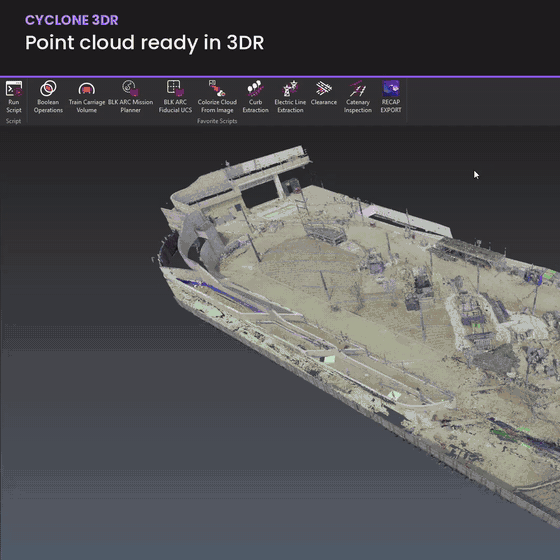

# Export to ReCap (RCS / RCP) for Leica Cyclone 3DR

One click from **Cyclone 3DR** point clouds to **Autodesk ReCap** files, without babysitting imports.



## What it does

- Exports selected 3DR clouds to a single **`.rcs`** or an **`.rcp` project + Support folder**
- Clouds kept **separate** or **merged** into one scan
- Optional: **inspection (deviation) colours baked into RGB**, so the RCS shows the same colour map as 3DR
- Temporary format of your choice: **LAS** (fastest), **E57** or **PTS**
- 3DR is only busy while it writes the temporary file. Autodesk ReCap's command-line converter (`decap.exe`) indexes it **in the background** with a progress window
- **ACC / Autodesk Docs safe:** all temporary work happens in a local work folder; only finished files land in the output folder
- `.rcp` projects are written with **relative scan paths**, so the project + Support folder can be moved or opened from ACC on another PC

## Requirements

| | |
|---|---|
| Leica Cyclone 3DR | 2026.1 (tested). Other versions untested - feedback welcome |
| Autodesk ReCap | Installed **and licensed** on the same PC (the converter only runs with a valid licence) |
| OS | Windows (uses built-in PowerShell and robocopy) |

## Install

1. Download the latest zip from **[Releases](../../releases)** and extract it anywhere.
2. In 3DR: **Script** tab > **Run Script** > open `Export_to_ReCap.js`.
3. Optional: add it to your **Favorite Scripts** (star in the script editor) with `ReCap_Export_icon.png` as the icon.

## Use

1. Select the cloud(s) in the 3DR tree (or run with nothing selected and click clouds in the 3D view, **Esc** when done).
2. Run the script and choose:
   - **Output:** RCS file(s) only | RCP project + Support folder
   - **Clouds:** Separate | Combined (merged into one scan)
   - **Output folder** and **Name**
   - **Temporary format** and **Bake inspection colours**
   - **Settings** (first run only, remembered): work folder for temporary files, and the location of `decap.exe` if ReCap is installed somewhere non-standard
3. Click **OK**. 3DR is free again once the temporary file is written; the progress window turns green when done.

See [`README.txt`](README.txt) for troubleshooting and notes.

## How it works

```
3DR cloud ──► temporary LAS / E57 / PTS ──► decap.exe (ReCap) ──► .rcs / .rcp ──► output folder
   (optional: bake inspection colours,        (background,          (relative paths
    merge clouds - on temporary copies)        progress window)      added to .rcp)
```

Your 3DR clouds are never modified.

## Disclaimer

Independent tool, not affiliated with or endorsed by Leica Geosystems or Autodesk. Cyclone 3DR is a product of Leica Geosystems; ReCap and DeCap are products of Autodesk. Provided as-is, without warranty - test on non-critical data first.

---
Made by **Ahmed El-Gohary** - Reality Capture & Scan-to-BIM Specialist.
